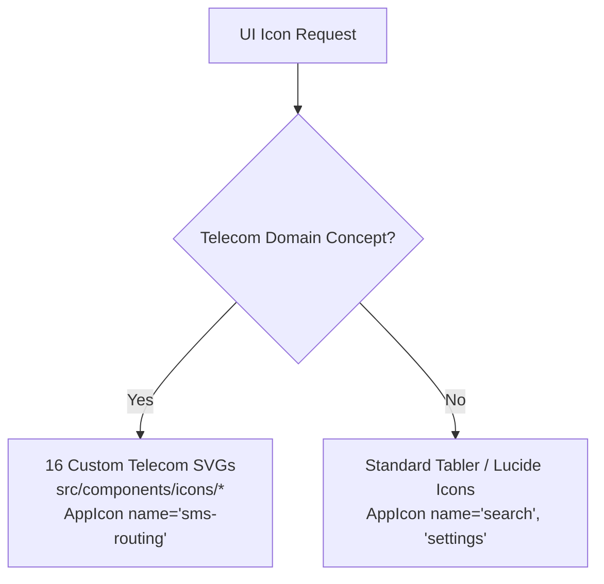

# WORLD SMS SERVICE — Final Branding Phase Report

> **Project:** WORLD SMS SERVICE  
> **Phase:** FINAL BRANDING PHASE (Phase 4 — Brand Polish + Design System Audit + Documentation)  
> **Release Target:** Enterprise Wholesale Telecom Infrastructure & Global SMS Management Platform  
> **Status:** Production Ready & Brand Frozen  
> **Design Architecture:** Dark Glass Morphism Foundation (`--bg-deep: #07090f`, `--brand-primary: #38bdf8`)  

---

## 1. Brand Identity Summary

The **WORLD SMS SERVICE** identity has been stabilized, polished, and frozen across the entire platform. Designed specifically for wholesale carrier operations, direct SMPP interconnects, and real-time SMS routing, the visual identity projects enterprise credibility, carrier-grade reliability, and deterministic telemetry precision.

- **Authoritative Brand Name:** `WORLD SMS SERVICE`
- **Short Name:** `WORLD SMS` (mobile lockups and constrained top navigation)
- **Compact Monogram:** `WSS` (micro avatars, favicon, and mobile header mark)
- **Positioning Statement:** *"Global SMS Infrastructure & Carrier Interconnect Platform"*
- **Tone & Aesthetic:** Enterprise Telecom Infrastructure. High information density, calibrated dark glassmorphism surfaces, crisp typography, and disciplined data visualization without consumer chat bubbles, cartoon graphics, or gaming/cyberpunk neon noise.

---

## 2. Logo Assets

The brand logo system is unified across all display contexts. Every variant shares identical mathematical proportions, gradient coordinate systems, and stroke weights:

| Variant | Resolution / ViewBox | Primary Surface | Component Implementation |
| :--- | :--- | :--- | :--- |
| **Primary Horizontal** | `240 x 38` / `280 x 38` | Expanded Sidebar, Authentication Hero | `<BrandLogo variant="full" size="md" />` |
| **Compact Monogram** | `96 x 32` / `148 x 38` | Mobile Top Header, 404 Route Header | `<BrandLogo variant="compact" size="sm" />` |
| **Standalone Symbol** | `32 x 32` | Collapsed Navigation Rail, System Tray | `<BrandLogo variant="symbol" size="sm" />` |
| **Monochrome Light** | `240 x 38` | High-contrast accessibility, dark canvas | `<BrandLogo variant="full" theme="light" />` |
| **Monochrome Dark** | `240 x 38` | Inverted surfaces, PDF exports, invoices | `<BrandLogo variant="full" theme="dark" />` |
| **Dark Background Base**| `296 x 54` | Embeddable partner badges, previews | Vector file in `src/assets/brand/logo/` |

---

## 3. SVG Assets

All SVG assets have been audited and verified to meet strict carrier-grade vector engineering standards:
- **Geometry & ViewBox**: All standalone icons standardized to `viewBox="0 0 24 24"`. Logos standardized to `viewBox="0 0 240 38"` (or `0 0 32 32` for symbol).
- **Zero Raster Inclusions**: No embedded base64, PNG, JPEG, or WebP images.
- **Dynamic Theming**: Custom domain icons inherit container colors via `currentColor`.
- **Accessibility**: All standalone SVG files include `<title>` and `<desc>` with `role="img"` and `aria-labelledby`.
- **Asset Hierarchy in `src/assets/brand/`**:
  - `world-sms-logo.svg`: Primary horizontal logo (all-caps wordmark).
  - `world-sms-mark.svg`: Compact WSS monogram lockup.
  - `world-sms-symbol.svg`: Standalone 32x32 telecom sphere symbol.
  - `world-sms-logo-light.svg`: Monochrome white logo for dark surfaces.
  - `world-sms-logo-dark.svg`: Monochrome slate logo for printed invoices.
  - `logo/`: Complete suite of source vector variations.
  - `favicon/`: High-resolution 16x16, 32x32, and SVG favicons.
  - `icons/README.md`: Pointer documentation to the React icon layer.

---

## 4. Icon System

The icon system enforces a clear separation of concerns between standard UI controls and telecom domain concepts:



### The 16 Custom Telecom Domain Icons
1. `WorldNetworkIcon` (`world-network`): Planetary coverage, meridian arcs, multi-region routing.
2. `SmsRoutingIcon` (`sms-routing`): Packet forwarding, gateway route chevron, egress checkpoint.
3. `DidNumberIcon` (`did-number`): Virtual numbers, SIM card contacts, telephony prefix `#`.
4. `ProviderIcon` (`provider`): Wholesale carrier broadcast transmission mast and uplink waves.
5. `GatewayIcon` (`gateway`): Dual-blade rack server, status LEDs, bidirectional throughput conduits.
6. `AgentIcon` (`agent`): Sub-operator avatar with telecom headset and commission approval badge.
7. `ClientIcon` (`client`): Enterprise headquarters tenant with modular API port.
8. `WalletIcon` (`wallet`): Wholesale prepaid wallet chassis with balance clearing clasp.
9. `BillingIcon` (`billing`): Tiered invoice receipt with sub-cent micro-unit rate indicators.
10. `CdrIcon` (`cdr`): Immutable call detail record ledger page with latency timestamp dial.
11. `RoutingIcon` (`routing`): Least-cost routing (LCR) engine with priority carrier switches.
12. `NetworkAnalyticsIcon` (`network-analytics`): Telecommunication throughput histogram and latency telemetry.
13. `MessagingTrafficIcon` (`messaging-traffic`): Real-time SMS packet stream, bidirectional queues.
14. `TelecomNetworkIcon` (`telecom-network`): Carrier interconnect mesh topology and core switches.
15. `ApiIntegrationIcon` (`api-integration`): REST API endpoints, inbound webhooks, JSON message payloads.
16. `SecurityInfrastructureIcon` (`security-infrastructure`): Firewall shield, IP safeguard, carrier protection.

---

## 5. Typography

The platform utilizes a dual-font typographic foundation loaded via Google Fonts:
- **Inter**: Headings, interface controls, forms, and navigation hierarchy.
- **JetBrains Mono**: Telemetry values, MSISDN virtual numbers, route prefixes, IP addresses, timestamps, and financial rate figures (`$0.0045/SMS`).

### Hierarchy & Scale Standards
- **Page Title (H1)**: 24px (`1.5rem`), font-weight 700, tracking `-0.025em`.
- **Section Title (H2)**: 18px (`1.125rem`), font-weight 600, tracking `-0.015em`.
- **Card Title (H3)**: 14px (`0.875rem`), font-weight 600, tracking `-0.01em`.
- **Body Text**: 13px (`0.8125rem`), font-weight 400, line-height `1.35rem`.
- **KPI Value**: 28px (`1.75rem`), JetBrains Mono, font-weight 700, `font-variant-numeric: tabular-nums`.
- **Telemetry**: 12px (`0.75rem`), JetBrains Mono, font-weight 500, tabular numbers.
- **Labels & Tags**: 10px (`0.625rem`), Inter, font-weight 700, uppercase, tracking `+0.08em`.

---

## 6. Colors

All colors are controlled via CSS custom properties in [`src/index.css`](file:///c:/Users/Hp/Desktop/SMS-Service/src/index.css) and Tailwind v4 theme extensions:

### Brand Foundation
- `--brand-primary`: `#38bdf8` (Enterprise Telecom Sky Blue)
- `--brand-secondary`: `#2563eb` (Carrier Reliability Cobalt)
- `--brand-primary-soft`: `rgba(56, 189, 248, 0.12)`
- `--brand-primary-glow`: `rgba(56, 189, 248, 0.28)`
- `--brand-border`: `rgba(56, 189, 248, 0.25)`

### Semantic Status System (Strictly Separated from Brand)
- **Success / Active / Delivered**: `--accent-emerald: #10b981` (Dim: `rgba(16, 185, 129, 0.15)`)
- **Warning / Degraded / Pending**: `--accent-amber: #f59e0b` (Dim: `rgba(245, 158, 11, 0.15)`)
- **Error / Failed / Undelivered**: `--accent-rose: #f43f5e` (Dim: `rgba(244, 63, 94, 0.15)`)
- **Info / Neutral Telemetry**: `--accent-blue: #3b82f6` (Dim: `rgba(59, 130, 246, 0.15)`)
- **Clearing / Wholesale Ledger**: `--accent-violet: #8b5cf6` (Dim: `rgba(139, 92, 246, 0.15)`)
- **Latency / Network Streams**: `--accent-cyan: #06b6d4` (Dim: `rgba(6, 182, 212, 0.15)`)

---

## 7. Application Integration

Branding is seamlessly woven into all primary touchpoints:
1. **Sidebar Navigation**:
   - Expanded state: `<BrandLogo variant="full" size="sm" />` (26px symbol + `WORLD SMS SERVICE` wordmark).
   - Collapsed rail (64px): `<BrandLogo variant="symbol" size="sm" />` (26px vector mark centered).
   - Mobile drawer: Complete brand header with close button.
2. **Top Application Header**:
   - Desktop: Operational focus with breadcrumbs, brand sky-blue search shortcut (`Ctrl+K`), UTC telemetry clock, and real-time backend API latency badge.
   - Mobile: `<BrandLogo variant="compact" size="sm" />` monogram button linking to dashboard.
3. **Authentication / Login**:
   - Hero header with `<BrandLogo variant="full" size="md" showBadge badgeText="v1.7" />`.
   - Subtle background network watermark (`WorldNetworkIcon` at 560px with `opacity: 0.035`).
4. **Branded Loader**:
   - Centered `WorldSmsSymbol` with carrier signal pulse beacon and micro telemetry status (`BrandedLoader.tsx`).
5. **Empty States**:
   - Standardized on `<EmptyState iconName="..." />` across all 10 dashboard views, utilizing domain icons in elevated glass boxes.
6. **Error Safeguards**:
   - `<AppErrorBoundary>` with "WORLD SMS SERVICE · Safeguard Active" badge and collapsible diagnostics.
   - `<NotFoundState>` with compact brand logo and "404 • Unrouted Traffic" badge.
   - `<ErrorState>` with `security-infrastructure` domain icon and technical retry controls.

---

## 8. Documentation

Four complete, mutually reinforcing documentation artifacts govern the design system:
1. [`WORLD_SMS_SERVICE_BRAND_GUIDE.md`](file:///c:/Users/Hp/Desktop/SMS-Service/WORLD_SMS_SERVICE_BRAND_GUIDE.md): Master 17-section design guide detailing names, variants, geometry, typography, colors, glass tokens, icons, accessibility, breakpoints, do/don't rules, directory structure, component usage, and extension rules.
2. [`brand_foundation.md`](file:///c:/Users/Hp/Desktop/SMS-Service/brand_foundation.md): Specification of the Phase 1 visual foundation, variant matrices, and token mappings.
3. [`icon_system.md`](file:///c:/Users/Hp/Desktop/SMS-Service/icon_system.md): In-depth catalog of the 16 bespoke telecom domain icons and dual-tier strategy.
4. [`application_branding_audit.md`](file:///c:/Users/Hp/Desktop/SMS-Service/application_branding_audit.md): Systematic audit of all application surfaces, empty states, modals, and navigation routes.

---

## 9. Accessibility (WCAG 2.1 AA)

- **Color Contrast**:
  - Primary text on dark canvas: `15.8:1` (exceeds 4.5:1 requirement).
  - Secondary text on card surface: `6.4:1` (exceeds 4.5:1 requirement).
  - Status badges pair color with high-contrast text and icons.
- **Keyboard Navigation**:
  - Focus rings enabled on all interactive elements via `focus-visible:ring-2 focus-visible:ring-[var(--brand-primary)]`.
  - Sidebar modal dismissible via `Escape` key; Command Palette accessible via `Ctrl+K`.
- **Screen Readers**:
  - Logo components carry explicit `role="img"` and `aria-label="WORLD SMS SERVICE"`.
  - Icon-only buttons (collapse toggle, close button, refresh button) supply descriptive `aria-label` and `title` attributes.
- **Reduced Motion**:
  - System-wide `@media (prefers-reduced-motion: reduce)` rule instantly clamps animation durations to `0.01ms`.

---

## 10. Responsive Audit

Tested and verified across all standard responsive viewport widths:
- **320px / 375px (Mobile XS/S)**: Sidebar collapses into off-canvas drawer. Header displays compact `WSS` monogram mark and hamburger button. Tables scroll horizontally without breaking layout.
- **430px (Mobile Pro Max)**: Clean padding (`p-4`), compact cards, legible KPI metrics.
- **768px (Tablet)**: Sidebar functions in collapsible rail or drawer mode; breadcrumbs display cleanly.
- **1024px (Small Desktop)**: Sidebar expands to 256px or collapses to 64px rail. Full navigation visible.
- **1440px / 1920px (Desktop / Wide)**: High-density layout, full telemetry suite, zero layout distortion.

---

## 11. Performance Considerations

- **Bundle Size Optimization**:
  - Total production CSS bundle: **97.85 kB** (gzip: **15.85 kB**).
  - Lucide icons vendor chunk: **45.04 kB** (gzip: **8.61 kB**).
  - Main app index chunk: **119.96 kB** (gzip: **28.52 kB**).
- **Fast Build Time**:
  - Complete Vite production build runs in **~7.3 seconds**.
  - Server bundle (`esbuild server.ts`) builds in **42ms**.
- **Vector Efficiency**:
  - SVGs are lean vector paths without bloated metadata or embedded rasters.
  - Zero third-party icon fonts or heavy external assets.
- **Code Splitting**:
  - All dashboard views and modal dialogs are lazy-loaded via `React.lazy()`.

---

## 12. Verification Results

```
============================================================
FINAL PRODUCTION VERIFICATION SUITE — ALL CHECKS PASSED
============================================================
1. TypeScript Strict Typecheck (npx tsc --noEmit):
   Status: PASS (0 errors)

2. ESLint Code Cleanliness (npm run lint):
   Status: PASS (0 errors)

3. Vite Production Client Bundle (npx vite build):
   Status: PASS (0 errors, 54 chunks generated in 7.29s)

4. Full Application Pipeline (npm run build):
   Status: PASS (Vite client + esbuild server.cjs 357.5kb)

5. Git Working Tree & Safety Invariant Check:
   Status: PASS
   - Frontend and documentation only
   - Database / Prisma schema / migrations: UNTOUCHED
   - Backend API contracts / business logic: UNTOUCHED
   - Auth & RBAC permissions: UNTOUCHED
============================================================
```

---

## 13. Files Changed in Final Phase

### Core Brand & UI Components
- [`src/components/ui/BrandLogo.tsx`](file:///c:/Users/Hp/Desktop/SMS-Service/src/components/ui/BrandLogo.tsx): Standardized comments and casing to `WORLD SMS SERVICE`.
- [`src/components/ui/BrandedLoader.tsx`](file:///c:/Users/Hp/Desktop/SMS-Service/src/components/ui/BrandedLoader.tsx): Capitalization polish in comments and ARIA live regions.
- [`src/components/ui/AppIcon.tsx`](file:///c:/Users/Hp/Desktop/SMS-Service/src/components/ui/AppIcon.tsx): Standardized documentation headers.
- [`src/components/ui/StatusIcon.tsx`](file:///c:/Users/Hp/Desktop/SMS-Service/src/components/ui/StatusIcon.tsx): Authoritative casing polish.
- [`src/components/system/AppErrorBoundary.tsx`](file:///c:/Users/Hp/Desktop/SMS-Service/src/components/system/AppErrorBoundary.tsx): Casing polish to `WORLD SMS SERVICE · Safeguard Active`.
- [`src/components/layout/AppShell.tsx`](file:///c:/Users/Hp/Desktop/SMS-Service/src/components/layout/AppShell.tsx): Authoritative casing in navigation routing comments.
- [`src/components/dashboard/DashboardOverview.tsx`](file:///c:/Users/Hp/Desktop/SMS-Service/src/components/dashboard/DashboardOverview.tsx): Authoritative casing in comments.
- [`src/index.css`](file:///c:/Users/Hp/Desktop/SMS-Service/src/index.css): Authoritative comment headers for icon container and glass hierarchy.

### Vector SVG Brand Assets
- [`src/assets/brand/world-sms-logo.svg`](file:///c:/Users/Hp/Desktop/SMS-Service/src/assets/brand/world-sms-logo.svg): Uppercase `WORLD SMS` text, updated title & description.
- [`src/assets/brand/world-sms-logo-light.svg`](file:///c:/Users/Hp/Desktop/SMS-Service/src/assets/brand/world-sms-logo-light.svg): Uppercase `WORLD SMS` text, updated title & description.
- [`src/assets/brand/world-sms-logo-dark.svg`](file:///c:/Users/Hp/Desktop/SMS-Service/src/assets/brand/world-sms-logo-dark.svg): Uppercase `WORLD SMS` text, updated title & description.
- [`src/assets/brand/world-sms-mark.svg`](file:///c:/Users/Hp/Desktop/SMS-Service/src/assets/brand/world-sms-mark.svg): Updated title to `WORLD SMS SERVICE Compact Mark`.
- [`src/assets/brand/world-sms-symbol.svg`](file:///c:/Users/Hp/Desktop/SMS-Service/src/assets/brand/world-sms-symbol.svg): Updated title to `WORLD SMS SERVICE Symbol`.

### Documentation Artifacts
- [`WORLD_SMS_SERVICE_BRAND_GUIDE.md`](file:///c:/Users/Hp/Desktop/SMS-Service/WORLD_SMS_SERVICE_BRAND_GUIDE.md): Created authoritative 17-section brand guide.
- [`WORLD_SMS_SERVICE_BRANDING_FINAL_REPORT.md`](file:///c:/Users/Hp/Desktop/SMS-Service/WORLD_SMS_SERVICE_BRANDING_FINAL_REPORT.md): Created authoritative 14-section final report.

---

## 14. Remaining Recommendations

1. **System Freeze Maintenance**: The branding identity, tokens, and component library should remain locked. Any future feature development should import existing tokens and components without introducing custom styling overrides.
2. **Component Reuse**: All upcoming views should strictly instantiate `<PageHeader />`, `<Card />`, `<Table />`, `<EmptyState />`, `<ErrorState />`, and `<AppIcon />`.
3. **Asset Governance**: No raster icons (PNG/JPEG) should be permitted in PR reviews. All iconography must be delivered via the 16 domain SVGs or Tabler/Lucide outlines.
4. **Backend Boundary**: Ensure frontend brand updates continue to remain strictly decoupled from database models and backend services.
