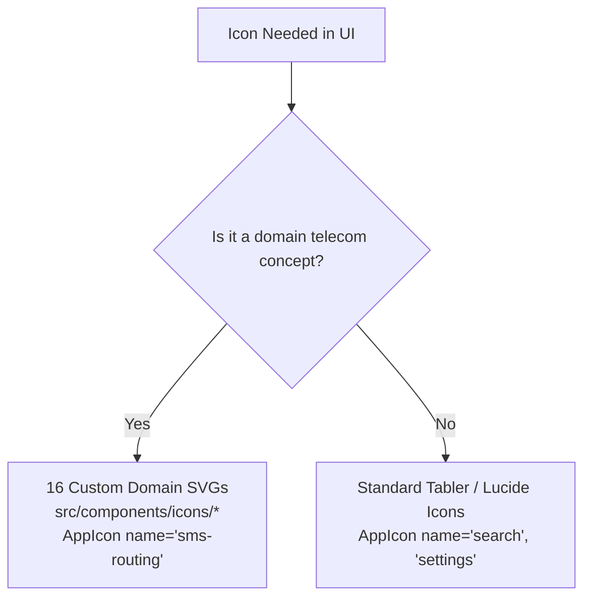

# WORLD SMS SERVICE — Official Brand Style & Identity Guide

> **Authoritative Specification Version 2.0 (Production Release — Frozen)**  
> **Brand Name:** `WORLD SMS SERVICE`  
> **Platform Domain:** Enterprise B2B Telecom Infrastructure & Global SMS Routing  
> **Visual Architecture:** Dark Glass Morphism Enterprise Telecom System  

---

## Table of Contents
1. [Brand Name & Positioning](#1-brand-name--positioning)
2. [Logo System](#2-logo-system)
3. [Logo Variants](#3-logo-variants)
4. [Symbol Anatomy & Geometry](#4-symbol-anatomy--geometry)
5. [Typography Hierarchy](#5-typography-hierarchy)
6. [Color Palette & Semantic System](#6-color-palette--semantic-system)
7. [Design Tokens & CSS Custom Properties](#7-design-tokens--css-custom-properties)
8. [Glass Morphism Rules (5-Level Hierarchy)](#8-glass-morphism-rules-5-level-hierarchy)
9. [Icon System Architecture](#9-icon-system-architecture)
10. [Tabler / Lucide Usage Rules](#10-tabler--lucide-usage-rules)
11. [Custom SVG Rules](#11-custom-svg-rules)
12. [Accessibility Rules (WCAG 2.1 AA)](#12-accessibility-rules-wcag-21-aa)
13. [Responsive Rules & Breakpoints](#13-responsive-rules--breakpoints)
14. [Do / Don't Examples](#14-do--dont-examples)
15. [Asset Directory Structure](#15-asset-directory-structure)
16. [Component Usage Examples](#16-component-usage-examples)
17. [Future Branding Extension Rules](#17-future-branding-extension-rules)

---

## 1. Brand Name & Positioning

- **Official Brand Name**: `WORLD SMS SERVICE`
- **Exact Capitalization Rule**: `WORLD SMS SERVICE` (all-caps wordmark in branding surfaces, titles, headers, and UI banners).
- **Short Name**: `WORLD SMS` (permitted only in mobile notification titles and constrained headers).
- **Monogram**: `WSS` (used strictly in ultra-compact avatars, mobile top-bar lockups, and small badges).
- **Core Domain**: Enterprise Wholesale Telecom Infrastructure, Carrier Interconnect, Virtual Numbers (DID), and Real-Time SMS Routing.
- **Enterprise Tagline**: *"Global SMS Infrastructure & Carrier Interconnect Platform"*

### Brand Positioning Pillars
1. **Enterprise Infrastructure**: Authoritative, robust, and dependable like major telecommunication carriers (AT&T, Telnyx, Twilio, Sinch).
2. **Technical Precision**: Microsecond routing latency, SMPP protocol binds, sub-cent billing accuracy, and deterministic packet delivery.
3. **Global Connectivity**: Planetary carrier network coverage, international DID numbering, and multi-tenant clearance.
4. **Disciplined Minimalism**: Serious, clean, high-density dashboard UI. Free from cartoonish graphics, excessive neon glows, or consumer chat app styling.

---

## 2. Logo System

The official **WORLD SMS SERVICE** logo pairs an engineered vector telecom symbol with an exact uppercase typographic lockup.

```mermaid
graph LR
    Symbol[Telecom Sphere Symbol] + Wordmark[WORLD SMS SERVICE] --> FullLogo[Primary Horizontal Logo]
    Symbol + Monogram[WSS] --> CompactLogo[Compact Monogram Mark]
    Symbol --> StandaloneSymbol[Symbol Only: Collapsed Sidebar / Favicon]
```

### Core Construction Rules
- **Aspect Ratio**: The primary lockup maintains an aspect ratio of `240:38` (or `280:38` in extended vector).
- **Clearspace**: Maintain a clearspace border equal to at least 50% of the symbol width (`0.5x`) around all logos.
- **Background Contrast**: Must always be placed on dark backgrounds (`#07090f`, `#0c1017`) or glass panels (`rgba(13, 17, 28, 0.72)`).
- **No Distortion**: Never stretch, skew, rotate, or alter vector node proportions.
- **No Drop Shadows**: Never add arbitrary blur shadows or heavy glow filters outside the established design token `--brand-primary-glow`.

---

## 3. Logo Variants

The brand provides 6 authoritative variants to serve every physical and digital surface:

| Variant | Dimensions / ViewBox | Primary Surface | Implementation |
| :--- | :--- | :--- | :--- |
| **Primary (Full)** | `240 x 38` / `280 x 38` | Expanded Sidebar, Login Hero, Splash Screen | `<BrandLogo variant="full" size="md" />` |
| **Compact (Mark)** | `96 x 32` / `148 x 38` | Mobile Top Header, 404 Route Header | `<BrandLogo variant="compact" size="sm" />` |
| **Symbol Only** | `32 x 32` | Collapsed Sidebar (64px Rail), App Launchers | `<BrandLogo variant="symbol" size="sm" />` |
| **Monochrome Light** | `240 x 38` | Ultra-dark surfaces, monochrome reports, high contrast | `<BrandLogo variant="full" theme="light" />` |
| **Monochrome Dark** | `240 x 38` | Inverted white surfaces, export PDFs, printed invoices | `<BrandLogo variant="full" theme="dark" />` |
| **Dark Background Base**| `296 x 54` | Embeddable vector badges, third-party carrier previews | [`world-sms-service-primary-darkbg.svg`](file:///c:/Users/Hp/Desktop/SMS-Service/src/assets/brand/logo/world-sms-service-primary-darkbg.svg) |

---

## 4. Symbol Anatomy & Geometry

The **WORLD SMS SERVICE** symbol is an SVG vector construct embodying global carrier routing:

```
          ╭─────────╮             <- Outer Sphere: Radius 13px (Global Reach)
        ╭─│───•─────│─╮           <- Meridian Arc: Ellipse rx=6.5, ry=13 (SMPP Binds)
───────[•]────▶────[•]───────   <- Carrier Trunk & Directional Chevron (M 3 16 H 29)
        ╰─│───•─────│─╯           <- Latitude Arcs: Upper & Lower Telemetry
          ╰─────────╯             <- Ingress (#60a5fa), Core (#ffffff), Egress (#34d399) Nodes
```

1. **Global Outer Sphere**: Scalable circle (`r=13`), stroke 2px with sky-blue to cobalt gradient (`#38bdf8` -> `#2563eb`).
2. **Meridian Arc**: Ellipse (`rx=6.5, ry=13`), stroke 1.5px dashed (`3 1.5`), representing telecom meridian clearing.
3. **Telemetry Latitude Arcs**: Upper and lower arcs (`stroke=1.25px, opacity=0.65`) providing 3D spherical depth.
4. **Primary High-Throughput Carrier Trunk**: Horizontal line (`M 3 16 H 29`), stroke 2px, representing direct SMPP v3.4 carrier interconnect.
5. **Directional Delivery Chevron**: Centered white vertex (`M 13.5 12.5 L 17.5 16 L 13.5 19.5`), stroke 2px, symbolizing real-time delivery report (DLR) forwarding.
6. **Network Checkpoint Nodes**:
   - Ingress Node: Cyan (`#60a5fa`, radius 1.75px)
   - Core Processing Node: White (`#ffffff`, radius 2.25px)
   - Egress Carrier Node: Emerald (`#34d399`, radius 1.75px)

---

## 5. Typography Hierarchy

The typographic system utilizes two Google Fonts loaded in [`index.html`](file:///c:/Users/Hp/Desktop/SMS-Service/index.html):
- **Inter**: Primary UI font for headings, navigation, buttons, and form labels.
- **JetBrains Mono**: Technical monospace font for DIDs, timestamps, telemetry, financial numbers, and JSON payloads.

| Token / Class | Font Family | Size | Weight | Tracking | Purpose & Usage |
| :--- | :--- | :--- | :--- | :--- | :--- |
| `.font-brand-wordmark` | Inter | 14px / 16px | 800 | `-0.025em` | Brand lockups & navigation header |
| `.font-display` | Inter | 36px (2.25rem) | 800 | `-0.035em` | Auth hero & marketing landing |
| `.font-page-title` (H1)| Inter | 24px (1.5rem) | 700 | `-0.025em` | View page header title |
| `.font-section-title` (H2)| Inter | 18px (1.125rem)| 600 | `-0.015em` | Sub-sections, card group titles |
| `.font-card-title` (H3)| Inter | 14px (0.875rem)| 600 | `-0.01em` | Individual card titles, table headers |
| `.font-body` | Inter | 13px (0.8125rem)| 400 | `0` | Standard UI paragraphs & descriptions|
| `.font-caption` | Inter | 11px (0.6875rem)| 500 | `+0.01em` | Secondary metadata, helper text |
| `.font-label` | Inter | 10px (0.625rem) | 700 | `+0.08em` | Uppercase form labels & status tags |
| `.font-kpi` | JetBrains Mono | 28px (1.75rem) | 700 | `-0.02em` | Large KPI stats, tabular numbers |
| `.font-telemetry` | JetBrains Mono | 12px (0.75rem) | 500 | `0` | MSISDN prefixes, IP addresses, latencies |

---

## 6. Color Palette & Semantic System

All colors are centralized in [`src/index.css`](file:///c:/Users/Hp/Desktop/SMS-Service/src/index.css). Semantic colors must never be replaced by brand colors.

### Brand Identity Colors
```css
--brand-primary: #38bdf8;          /* Enterprise Telecom Sky Blue */
--brand-primary-hover: #2563eb;    /* Deep Cobalt Blue */
--brand-primary-soft: rgba(56, 189, 248, 0.12); /* Subtle glass tint */
--brand-primary-glow: rgba(56, 189, 248, 0.28); /* Ambient aura */
--brand-secondary: #2563eb;        /* Carrier High-Reliability Blue */
--brand-border: rgba(56, 189, 248, 0.25);        /* Brand container border */
--brand-surface: rgba(13, 17, 28, 0.72);         /* Structural panel glass */
```

### Strict Semantic Color Separation
| Semantic Purpose | Token | Hex Value | Soft Background | Usage Context |
| :--- | :--- | :--- | :--- | :--- |
| **Brand Identity** | `--brand-primary` | `#38bdf8` | `rgba(56, 189, 248, 0.12)` | Logos, brand symbols, primary buttons |
| **Success / Online** | `--accent-emerald` | `#10b981` | `rgba(16, 185, 129, 0.15)` | Delivered SMS, active SMPP bind, healthy system |
| **Warning / Pending**| `--accent-amber` | `#f59e0b` | `rgba(245, 158, 11, 0.15)` | Queue backlog, rate limit warning, pending approval |
| **Error / Failed** | `--accent-rose` | `#f43f5e` | `rgba(244, 63, 94, 0.15)` | Failed SMS, undelivered, rejected, carrier down |
| **Info / Telemetry** | `--accent-blue` | `#3b82f6` | `rgba(59, 130, 246, 0.15)` | Neutral informational messages, general stats |
| **Finance / Margin** | `--accent-violet` | `#8b5cf6` | `rgba(139, 92, 246, 0.15)` | Sub-cent margins, wholesale billing balances |
| **Network / Signal** | `--accent-cyan` | `#06b6d4` | `rgba(6, 182, 212, 0.15)` | Live traffic conduits, API latency indicators |

---

## 7. Design Tokens & CSS Custom Properties

The platform runs on a frozen, centralized token system in `:root`:

```css
:root {
  /* Canvas Backgrounds */
  --bg-deep: #07090f;
  --bg-surface: #0c1017;
  --bg-elevated: #111827;

  /* Glass Surface Tokens */
  --glass-bg: rgba(255, 255, 255, 0.04);
  --glass-bg-hover: rgba(255, 255, 255, 0.07);
  --glass-bg-active: rgba(255, 255, 255, 0.10);
  --glass-border: rgba(255, 255, 255, 0.08);
  --glass-border-hover: rgba(255, 255, 255, 0.14);
  --glass-border-active: rgba(255, 255, 255, 0.20);
  --glass-blur: 16px;
  --glass-blur-heavy: 24px;

  /* Text Contrast Hierarchy */
  --text-primary: rgba(255, 255, 255, 0.92);
  --text-secondary: rgba(255, 255, 255, 0.55);
  --text-tertiary: rgba(255, 255, 255, 0.35);
  --text-disabled: rgba(255, 255, 255, 0.20);

  /* Border Radii */
  --radius-sm: 8px;
  --radius-md: 12px;
  --radius-lg: 16px;
  --radius-xl: 20px;
  --radius-full: 9999px;
}
```

---

## 8. Glass Morphism Rules (5-Level Hierarchy)

To maintain enterprise legibility and avoid a "gaming/cyberpunk" aesthetic, the interface strictly adheres to 5 depth levels:

```
Level 0: Deep Canvas (#07090f)
  └── Level 1: Structural Glass Shell (rgba(13, 17, 28, 0.72), blur 16px)
        └── Level 2: Interactive Cards & Tables (rgba(18, 24, 38, 0.65), blur 16px)
              └── Level 3: Modal Dialogs & Flyouts (rgba(11, 15, 25, 0.90), blur 24px)
                    └── Level 4: Active / Focused Elements (var(--brand-primary-soft), brand border)
```

1. **Level 0 (Canvas)**: Non-interactive foundation background.
2. **Level 1 (Structural Shell)**: Header bar, navigation sidebar, and main view wrappers.
3. **Level 2 (Cards & Widgets)**: Content cards, metric containers, and data table bodies.
4. **Level 3 (Modals & Flyouts)**: Elevated dialogs with `0.90` opacity to ensure complete text readability over background dashboards.
5. **Level 4 (Active States)**: Selection indicators, focused inputs, and active navigation items.

---

## 9. Icon System Architecture

The icon architecture enforces a clean division between standard generic controls and specialized domain concepts:



---

## 10. Tabler / Lucide Usage Rules

Generic user interface actions must use standard outline icons from Lucide / Tabler:

- **Navigation / Controls**: `search`, `settings`, `close` (`X`), `menu`, `chevron-left`, `chevron-right`, `chevron-down`
- **Actions**: `plus`, `edit`, `trash`, `refresh`, `download`, `upload`, `copy`, `filter`
- **System**: `user`, `lock`, `unlock`, `eye`, `eye-off`, `clock`, `calendar`, `bell`

**Rules:**
- Render through `<AppIcon name="..." />` or direct Lucide imports.
- Default to `size="md"` (20px) or `size="sm"` (16px).
- Use `strokeWidth={1.75}` for optical consistency with custom domain icons.

---

## 11. Custom SVG Rules

Domain-specific telecommunication concepts are represented by 16 custom SVG components:

| # | Icon Identifier | Component | Domain Meaning |
| :- | :--- | :--- | :--- |
| 1 | `world-network` | [`WorldNetworkIcon`](file:///c:/Users/Hp/Desktop/SMS-Service/src/components/icons/WorldNetworkIcon.tsx) | Global coverage, multi-region routing |
| 2 | `sms-routing` | [`SmsRoutingIcon`](file:///c:/Users/Hp/Desktop/SMS-Service/src/components/icons/SmsRoutingIcon.tsx) | Packet transmission, message gateway routes |
| 3 | `did-number` | [`DidNumberIcon`](file:///c:/Users/Hp/Desktop/SMS-Service/src/components/icons/DidNumberIcon.tsx) | Virtual numbers, DID allocation, SIM prefix |
| 4 | `provider` | [`ProviderIcon`](file:///c:/Users/Hp/Desktop/SMS-Service/src/components/icons/ProviderIcon.tsx) | Wholesale carriers, telecommunications masts |
| 5 | `gateway` | [`GatewayIcon`](file:///c:/Users/Hp/Desktop/SMS-Service/src/components/icons/GatewayIcon.tsx) | Dual-blade rack server, SMPP binds |
| 6 | `agent` | [`AgentIcon`](file:///c:/Users/Hp/Desktop/SMS-Service/src/components/icons/AgentIcon.tsx) | Sub-operators, account managers, commissions |
| 7 | `client` | [`ClientIcon`](file:///c:/Users/Hp/Desktop/SMS-Service/src/components/icons/ClientIcon.tsx) | Enterprise tenants, client organizations |
| 8 | `wallet` | [`WalletIcon`](file:///c:/Users/Hp/Desktop/SMS-Service/src/components/icons/WalletIcon.tsx) | Prepaid balances, credits, wholesale billing |
| 9 | `billing` | [`BillingIcon`](file:///c:/Users/Hp/Desktop/SMS-Service/src/components/icons/BillingIcon.tsx) | Invoices, wholesale rate cards, ledger statements |
| 10| `cdr` | [`CdrIcon`](file:///c:/Users/Hp/Desktop/SMS-Service/src/components/icons/CdrIcon.tsx) | Call detail records, delivery status logs |
| 11| `routing` | [`RoutingIcon`](file:///c:/Users/Hp/Desktop/SMS-Service/src/components/icons/RoutingIcon.tsx) | LCR (Least Cost Routing), priority trunk tables |
| 12| `network-analytics` | [`NetworkAnalyticsIcon`](file:///c:/Users/Hp/Desktop/SMS-Service/src/components/icons/NetworkAnalyticsIcon.tsx) | Throughput metrics, carrier latency telemetry |
| 13| `messaging-traffic` | [`MessagingTrafficIcon`](file:///c:/Users/Hp/Desktop/SMS-Service/src/components/icons/MessagingTrafficIcon.tsx) | Inbound/outbound SMS streams, TPS gauges |
| 14| `telecom-network` | [`TelecomNetworkIcon`](file:///c:/Users/Hp/Desktop/SMS-Service/src/components/icons/TelecomNetworkIcon.tsx) | Carrier interconnect mesh, core switches |
| 15| `api-integration` | [`ApiIntegrationIcon`](file:///c:/Users/Hp/Desktop/SMS-Service/src/components/icons/ApiIntegrationIcon.tsx) | REST API endpoints, webhooks, JSON payloads |
| 16| `security-infrastructure` | [`SecurityInfrastructureIcon`](file:///c:/Users/Hp/Desktop/SMS-Service/src/components/icons/SecurityInfrastructureIcon.tsx) | Firewall, IP whitelists, safeguard shields |

**Technical Specifications:**
- All icons must have `viewBox="0 0 24 24"`.
- Must use `stroke="currentColor"` and `fill="none"` for path lines.
- Default `strokeWidth={1.75}`, `strokeLinecap="round"`, `strokeLinejoin="round"`.
- Zero embedded raster images, zero hardcoded inline colors.

---

## 12. Accessibility Rules (WCAG 2.1 AA)

1. **Color Independence**:
   - Status indicators must pair a semantic color with an explicit text label or unambiguous icon glyph (e.g. checkmark for success, triangle for warning, cross for error).
2. **Contrast Standards**:
   - Primary text (`rgba(255, 255, 255, 0.92)` on `#07090f`) provides `15.8:1` contrast ratio.
   - Secondary text (`rgba(255, 255, 255, 0.55)` on `#0c1017`) provides `6.4:1` contrast ratio.
3. **Keyboard Navigation & Focus**:
   - All interactive controls feature visible focus rings via:
     `focus-visible:ring-2 focus-visible:ring-[var(--brand-primary)] focus-visible:ring-offset-2 focus-visible:ring-offset-[var(--bg-deep)]`
4. **Accessible Labels**:
   - Icon-only buttons must supply `aria-label` or `title`.
   - Brand logos carry `aria-label="WORLD SMS SERVICE"`.
5. **Reduced Motion**:
   - System animations respect `prefers-reduced-motion: reduce`, instantaneously clamping animations and transitions to `0.01ms`.

---

## 13. Responsive Rules & Breakpoints

The UI adapts gracefully across all display dimensions without clipping, horizontal scrolling, or inaccessible controls:

| Breakpoint | Viewport Width | Sidebar Behavior | Header Behavior | Brand Logo |
| :--- | :--- | :--- | :--- | :--- |
| **Mobile XS** | `320px - 375px` | Hidden off-canvas drawer | Hamburger + Compact Mark | `<BrandLogo variant="compact" size="sm" />` |
| **Mobile Normal** | `375px - 430px` | Hidden off-canvas drawer | Hamburger + Compact Mark | `<BrandLogo variant="compact" size="sm" />` |
| **Tablet** | `768px - 1024px` | Collapsible 64px rail / Drawer | Breadcrumbs + Telemetry | `<BrandLogo variant="compact" size="sm" />` |
| **Desktop** | `1024px - 1440px` | 256px expanded or 64px rail | Search + Health + UTC Clock | `<BrandLogo variant="full" size="sm" />` |
| **Widescreen** | `1440px - 1920px+`| 256px fixed expanded | Full enterprise telemetry suite | `<BrandLogo variant="full" size="md" />` |

**Table Safety**: All tables must be enclosed in an `overflow-x-auto` wrapper (standard in `<Table />`) to prevent mobile viewport blowout.

---

## 14. Do / Don't Examples

### Typography & Branding
- **DO** write `WORLD SMS SERVICE` in all headings, documentation, and navigation.
- **DO NOT** write `World SMS`, `World Sms Service`, or `SMS Hub`.
- **DO** use JetBrains Mono for DIDs (`+18005550199`), latencies (`42ms`), and financial amounts (`$0.0045/SMS`).
- **DO NOT** use Inter for tabular financial figures or IP addresses.

### Color & Styling
- **DO** use `--accent-emerald` (`#10b981`) for active/delivered states.
- **DO NOT** use `--brand-primary` (`#38bdf8`) to represent delivery success.
- **DO** use `--glass-modal` (`0.90` opacity) for dialogs to ensure readability.
- **DO NOT** make dialog backgrounds semi-transparent (`< 0.80`) which creates visual clutter.

### Iconography
- **DO** use domain icons (`sms-routing`, `did-number`, `gateway`) for telecom concepts.
- **DO NOT** invent custom icons for standard actions (`search`, `settings`, `trash`).
- **DO** use vector SVGs exclusively.
- **DO NOT** import PNG, WebP, or GIF raster assets for icons or logos.

---

## 15. Asset Directory Structure

```
c:\Users\Hp\Desktop\SMS-Service\
├── public/
│   ├── favicon.svg                           # Production 32x32 SVG browser favicon
│   ├── apple-touch-icon.svg                  # 180x180 SVG shortcut icon
│   └── site.webmanifest                      # PWA metadata & dark theme color
├── src/
│   ├── assets/
│   │   └── brand/
│   │       ├── world-sms-logo.svg            # Primary horizontal logo (all-caps)
│   │       ├── world-sms-mark.svg            # Compact monogram lockup (WSS)
│   │       ├── world-sms-symbol.svg          # Standalone 32x32 vector symbol
│   │       ├── world-sms-logo-light.svg      # Monochrome light variant
│   │       ├── world-sms-logo-dark.svg       # Monochrome dark variant
│   │       ├── favicon/                      # Additional favicon resolutions
│   │       ├── logo/                         # Vector source package
│   │       └── icons/                        # Domain icons documentation pointer
│   └── components/
│       ├── icons/                            # 16 Individual domain React icons
│       │   ├── AgentIcon.tsx
│       │   ├── ApiIntegrationIcon.tsx
│       │   ├── BillingIcon.tsx
│       │   ├── CdrIcon.tsx
│       │   ├── ClientIcon.tsx
│       │   ├── DidNumberIcon.tsx
│       │   ├── GatewayIcon.tsx
│       │   ├── MessagingTrafficIcon.tsx
│       │   ├── NetworkAnalyticsIcon.tsx
│       │   ├── ProviderIcon.tsx
│       │   ├── RoutingIcon.tsx
│       │   ├── SecurityInfrastructureIcon.tsx
│       │   ├── SmsRoutingIcon.tsx
│       │   ├── TelecomNetworkIcon.tsx
│       │   ├── WalletIcon.tsx
│       │   ├── WorldNetworkIcon.tsx
│       │   ├── WorldSmsLogo.tsx
│       │   ├── WorldSmsMark.tsx
│       │   ├── WorldSmsSymbol.tsx
│       │   └── index.ts
│       └── ui/
│           ├── BrandLogo.tsx                 # Core brand logo component
│           ├── AppIcon.tsx                   # Unified icon component
│           ├── BrandedLoader.tsx             # Application loading state
│           ├── EmptyState.tsx                # Standardized empty states
│           ├── ErrorState.tsx                # Telecom diagnostic error states
│           ├── Badge.tsx                     # Semantic status badges
│           ├── Button.tsx                    # Accessible button primitives
│           └── Table.tsx                     # Responsive data tables
```

---

## 16. Component Usage Examples

### 1. Brand Logo
```tsx
import { BrandLogo } from '../ui/BrandLogo';

// Sidebar Expanded
<BrandLogo variant="full" size="sm" theme="accent" />

// Sidebar Collapsed Rail
<BrandLogo variant="symbol" size="sm" theme="accent" />

// Mobile Header
<BrandLogo variant="compact" size="sm" theme="accent" />
```

### 2. Unified Icon Component
```tsx
import { AppIcon } from '../ui/AppIcon';

// Custom Telecom Domain Concept
<AppIcon name="sms-routing" size="md" className="text-[var(--brand-primary)]" />

// Generic Standard UI Action
<AppIcon name="search" size="sm" className="text-[var(--text-secondary)]" />
```

### 3. Application Loader
```tsx
import { BrandedLoader } from '../ui/BrandedLoader';

<BrandedLoader message="Connecting to WORLD SMS SERVICE gateway..." fullScreen />
```

### 4. Empty State
```tsx
import { EmptyState } from '../ui/EmptyState';

<EmptyState
  iconName="did-number"
  title="No Virtual Numbers Allocated"
  description="Order direct-inward dialing (DID) numbers from upstream wholesale carriers."
/>
```

### 5. Error State
```tsx
import { ErrorState } from '../ui/ErrorState';

<ErrorState
  title="Gateway Connection Timed Out"
  message="Unable to communicate with the carrier routing core."
  onRetry={refetch}
/>
```

---

## 17. Future Branding Extension Rules

1. **Brand Freeze**: The **WORLD SMS SERVICE** brand identity is complete and frozen. No further changes to colors, tokens, or core geometry may be made without architectural sign-off.
2. **New Module Integration**: When developing future modules (e.g. Campaign Builder, Advanced CDR Exporter):
   - Always reuse existing glass levels (`surface-level-1`, `surface-level-2`, `surface-level-3`).
   - Use `<PageHeader />` with Inter bold page titles.
   - Use `<AppIcon name="..." />` for all icon needs.
3. **Adding New Domain Icons**:
   - If a new telecom concept is required (e.g., `RCS-Messaging`), design the SVG using the strict 24x24 viewBox, 1.75px stroke, and `currentColor` inheritance.
   - Add it to `src/components/icons/` and register in `src/components/ui/AppIcon.tsx`.
4. **Backend & Database Separation**:
   - Branding components and styling must remain strictly on the frontend.
   - Never couple database models, Prisma schemas, or backend API contracts to branding presentation logic.
