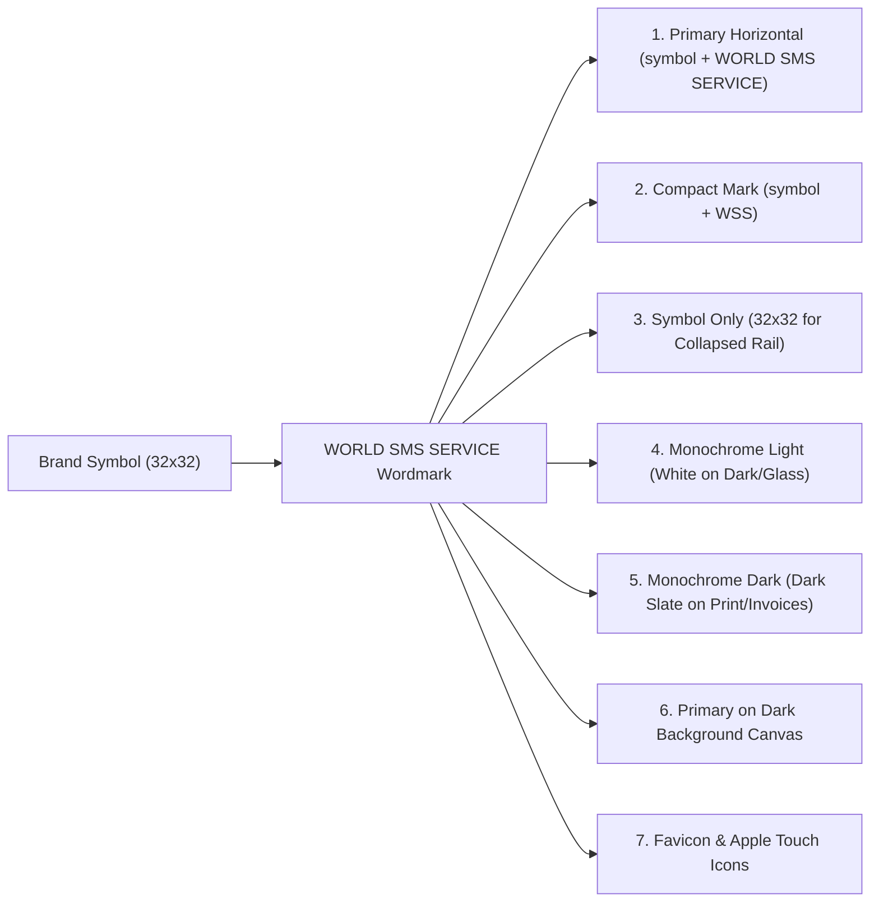

# WORLD SMS SERVICE — Brand Foundation Specification

> **Phase 1 Deliverable: Brand Visual Identity & Reusable Foundation**  
> **Official Brand**: `WORLD SMS SERVICE`  
> **Exact Capitalization Rule**: `WORLD SMS SERVICE` (all-caps wordmark, never camelCase, never hyphenated)  
> **Domain**: International Wholesale SMS & Telecom Infrastructure Platform  
> **UI Aesthetic**: Preserved Dark Glass Morphism (`--bg-deep: #07090f`)

---

## 1. Executive Summary & Objective

This document establishes the official visual identity, typography system, color tokens, and scalable SVG brand assets for **WORLD SMS SERVICE**. The visual language is engineered specifically for mission-critical enterprise telecom operations—reflecting carrier-grade connectivity, routing reliability, and operational precision rather than generic SaaS startup aesthetics.

All changes adhere strictly to the non-destructive constraints:
- **No backend changes**
- **No database changes**
- **No Prisma migrations**
- **No API contract changes**
- **Preserved existing dark Glass Morphism system**

---

## 2. Logo System & Variants

The logo combines four core telecom motifs:
1. **Global Outer Sphere**: Scalable sphere representing multi-region carrier routing.
2. **Meridian Arc**: Telecom meridian ellipse representing SMPP carrier interconnects.
3. **Primary Carrier Trunk**: Direct packet transmission highway connecting ingress and egress.
4. **Directional Delivery Chevron**: Sharp vertex symbolizing instant delivery status report (DLR) forwarding.
5. **Ingress / Core / Egress Nodes**: Cyan, white, and emerald nodes marking message lifecycle checkpoints.



### Complete Variant Matrix

| Variant Name | Dimensions / ViewBox | Primary Usage | File Path |
| :--- | :--- | :--- | :--- |
| **Primary Horizontal** | `280 x 38` | Expanded Sidebar, Navigation, Login Hero | [`src/assets/brand/logo/world-sms-service-primary.svg`](file:///c:/Users/Hp/Desktop/SMS-Service/src/assets/brand/logo/world-sms-service-primary.svg) |
| **Compact Mark** | `148 x 38` | Mobile Top Header, Narrow Displays | [`src/assets/brand/logo/world-sms-service-compact.svg`](file:///c:/Users/Hp/Desktop/SMS-Service/src/assets/brand/logo/world-sms-service-compact.svg) |
| **Symbol Only** | `32 x 32` | Collapsed Sidebar (64px Rail), App Launcher | [`src/assets/brand/logo/world-sms-service-symbol.svg`](file:///c:/Users/Hp/Desktop/SMS-Service/src/assets/brand/logo/world-sms-service-symbol.svg) |
| **Monochrome Light** | `280 x 38` | High-contrast accessibility, dark canvas | [`src/assets/brand/logo/world-sms-service-light.svg`](file:///c:/Users/Hp/Desktop/SMS-Service/src/assets/brand/logo/world-sms-service-light.svg) |
| **Monochrome Dark** | `280 x 38` | PDF Exports, Carrier settlement invoices | [`src/assets/brand/logo/world-sms-service-dark.svg`](file:///c:/Users/Hp/Desktop/SMS-Service/src/assets/brand/logo/world-sms-service-dark.svg) |
| **Dark Background Base** | `296 x 54` | Standalone badge embeds, previews | [`src/assets/brand/logo/world-sms-service-primary-darkbg.svg`](file:///c:/Users/Hp/Desktop/SMS-Service/src/assets/brand/logo/world-sms-service-primary-darkbg.svg) |
| **Browser Tab Favicon** | `32 x 32` | Browser bookmarks, tab bar | [`public/favicon.svg`](file:///c:/Users/Hp/Desktop/SMS-Service/public/favicon.svg) |
| **Apple Touch Icon** | `180 x 180` | iOS / iPadOS home screen shortcuts | [`public/apple-touch-icon.svg`](file:///c:/Users/Hp/Desktop/SMS-Service/public/apple-touch-icon.svg) |

---

## 3. Wordmark Typography System

The typography stack leverages existing Google Fonts (`Inter` and `JetBrains Mono`) without adding external font dependencies:

- **Brand Wordmark Font**: `Inter`, weight `700` (Bold) with `SMS` accented at `800` (Extrabold). Letter spacing `-0.025em`, uppercase `WORLD SMS SERVICE`.
- **Heading Font**: `Inter`, weights `600` / `700`, negative tracking for dense enterprise hierarchy.
- **UI / Body Font**: `Inter`, weight `400` (Regular) / `500` (Medium) for maximum legibility on dark glass.
- **Numeric / Telemetry Font**: `JetBrains Mono` (`font-feature-settings: 'tnum' on, 'zero' on; tabular-nums;`). Strictly used for financial credits, TPS counters, MSISDN prefixes, IP addresses, latency, and DLR codes.

### Typography Token Classes ([`src/index.css`](file:///c:/Users/Hp/Desktop/SMS-Service/src/index.css))

```css
/* Wordmark */
.font-brand-wordmark {
  font-family: var(--font-sans);
  font-weight: 800;
  letter-spacing: -0.025em;
  text-transform: uppercase;
}

/* Headings */
.font-page-title {
  font-family: var(--font-sans);
  font-size: 1.5rem;
  font-weight: 700;
  letter-spacing: -0.025em;
}

/* Telemetry & Financials */
.font-telemetry {
  font-family: var(--font-mono);
  font-size: 0.75rem;
  font-weight: 500;
  font-variant-numeric: tabular-nums;
}
```

---

## 4. Brand Color Tokens & Semantic Separation

Defined in `:root` and `@theme` in [`src/index.css`](file:///c:/Users/Hp/Desktop/SMS-Service/src/index.css):

```css
/* Core Brand Tokens */
--brand-primary: #38bdf8;          /* Enterprise Telecom Sky Blue */
--brand-primary-hover: #2563eb;
--brand-primary-soft: rgba(56, 189, 248, 0.12);
--brand-primary-glow: rgba(56, 189, 248, 0.28);
--brand-secondary: #2563eb;        /* Carrier High-Reliability Cobalt */
--brand-secondary-soft: rgba(37, 99, 235, 0.12);
--brand-glow: rgba(56, 189, 248, 0.35);
--brand-surface: rgba(13, 17, 28, 0.72);
--brand-border: rgba(56, 189, 248, 0.25);
--brand-text: rgba(255, 255, 255, 0.95);
--brand-text-muted: rgba(255, 255, 255, 0.55);

/* Preserved Semantic Status Colors (Untouched & Distinct) */
--accent-emerald: #10b981;         /* Operational / Success / Active */
--accent-amber: #f59e0b;           /* Warning / High Latency / Rate Limit */
--accent-rose: #ef4444;            /* Undelivered / Critical Error / Inactive */
--accent-blue: #38bdf8;            /* Information / Carrier Bind */
--accent-violet: #8b5cf6;          /* Financial Settlement / Ledger Balance */
```

*Rule*: `--brand-primary` must never replace semantic status colors. Delivery failures are always `--accent-rose` (`#ef4444`) and active carrier routes are always `--accent-emerald` (`#10b981`).

---

## 5. Brand Asset Folder Structure

```
src/assets/brand/
├── logo/
│   ├── world-sms-service-primary.svg         (Primary horizontal lockup)
│   ├── world-sms-service-compact.svg         (Compact WSS lockup)
│   ├── world-sms-service-symbol.svg          (Standalone 32x32 vector symbol)
│   ├── world-sms-service-light.svg           (Monochrome light on dark/glass)
│   ├── world-sms-service-dark.svg            (Monochrome dark on print/white)
│   └── world-sms-service-primary-darkbg.svg  (Standalone canvas base)
├── favicon/
│   ├── favicon.svg                           (32x32 browser tab icon)
│   ├── apple-touch-icon.svg                  (180x180 shortcut icon)
│   ├── favicon-32x32.svg                     (Fixed 32px rasterized SVG)
│   └── favicon-16x16.svg                     (High-contrast 16px simplified SVG)
└── icons/
    └── README.md                             (Pointer to TelecomIcons & AppIcon components)

public/
├── favicon.svg                               (Active production browser icon)
├── apple-touch-icon.svg                      (Active Apple touch icon)
└── site.webmanifest                          (PWA metadata for WORLD SMS SERVICE)
```

---

## 6. Global Brand Tokens & Glass Morphism Relationship

| Token Type | Value / CSS Variable | Description |
| :--- | :--- | :--- |
| **Logo Sizes** | `sm: 26px`, `md: 32px`, `lg: 42px`, `xl: 54px` | Parameterized in `BrandLogo.tsx` |
| **Border Radii** | `sm: 8px`, `md: 12px`, `lg: 16px`, `xl: 20px` | Enforced on cards, inputs, and modals |
| **Glass Blur** | `16px` standard, `24px` modal/flyout | Preserves glass depth without lag |
| **Focus Treatment** | `outline: 2px solid var(--brand-primary)` | Offset `2px`, WCAG 2.1 AA compliant |
| **Glass Surface** | `rgba(13, 17, 28, 0.72)` | Optimal contrast over ambient `#07090f` background |

---

## 7. Application Integration Points

1. **Browser Document Title ([`index.html`](file:///c:/Users/Hp/Desktop/SMS-Service/index.html))**:
   `WORLD SMS SERVICE — SMS Management Platform`
2. **Metadata & OpenGraph**:
   `og:site_name`, `og:title`, and `twitter:title` updated to `WORLD SMS SERVICE`.
3. **Sidebar Header ([`Sidebar.tsx`](file:///c:/Users/Hp/Desktop/SMS-Service/src/components/layout/Sidebar.tsx))**:
   Integrates `<BrandLogo variant={isCollapsed ? 'symbol' : 'full'} />` with zero layout shift on toggle.
4. **Authentication Portal ([`LoginView.tsx`](file:///c:/Users/Hp/Desktop/SMS-Service/src/components/auth/LoginView.tsx))**:
   Renders hero header with exact `WORLD SMS SERVICE` wordmark, role selection cards, and copyright notice.
5. **App Initialization Splash ([`App.tsx`](file:///c:/Users/Hp/Desktop/SMS-Service/src/App.tsx))**:
   Renders `<BrandLogo />` with `Initializing WORLD SMS SERVICE...`.

---

## 8. Quality Verification Results

```
==================================================
PHASE 1 VERIFICATION RESULTS
==================================================
1. TypeScript Typecheck (npx tsc --noEmit):
   Status: PASS (0 errors)

2. Code Linting (npm run lint):
   Status: PASS (0 errors)

3. Production Build (npx vite build):
   Status: PASS (0 errors, 8.74s)

4. Architecture & Scope Guards:
   - Backend untouched: YES
   - Database/Prisma untouched: YES
   - Existing routes preserved: YES
   - No unnecessary dependencies added: YES
==================================================
```

---

*Phase 1 Brand Foundation is complete. Awaiting user instructions before Phase 2.*
