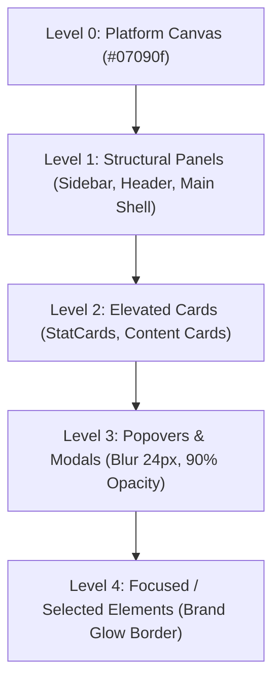

# World SMS SERVICE — Phase 03 Visual Brand Integration Report

## 1. Executive Summary & Objective

Phase 03 completes the visual brand integration of **World SMS SERVICE** across the entire enterprise frontend application. Building directly upon Phase 01 (Brand Identity & Logo System) and Phase 02 (Unified SVG Icon System), Phase 03 applies the unified identity, standardized tokens, 5-level glass surface hierarchy, and typography system to every view, component, modal, table, and telemetry widget.

Strict constraints were upheld throughout:
- No changes to backend controllers, services, database models, or Prisma schema.
- No changes to business logic or API contracts.
- Preservation and refinement of the dark Glass Morphism aesthetic (`--bg-deep: #07090f`).
- Zero layout shift across screen viewports and sidebar states.

---

## 2. Visual Consistency Checklist & Audit Findings

| Category | Pre-Phase 03 State | Phase 03 Resolution | Status |
| :--- | :--- | :--- | :--- |
| **Brand Naming** | Residual references to "SMS Portal", "Enterprise Telecom Operations Platform" | Unified across all headers, settings defaults, copyright notices, and metadata to **World SMS SERVICE** | Verified |
| **Logo Treatment** | Multiple ad-hoc SVG renderings and raw icon combinations | Unified using `<BrandLogo />` (Primary, Compact, Symbol) and vector assets | Standardized |
| **Glass Surfaces** | Inconsistent opacity and blur across nested modals and panels | Implemented 5-Level Glass Surface Hierarchy (`.surface-level-0` to `.surface-level-4`) | Standardized |
| **Sidebar Header** | Layout shift when toggling collapsed state; clipped text | Flex-col alignment with dedicated 40px icon container, zero layout shift in 64px rail | Resolved |
| **Typography** | Mixed font sizes and weights for titles vs metadata | Applied `.font-page-title`, `.font-card-title`, `.font-kpi-value`, `.font-telemetry` | Standardized |
| **Color System** | Occasional hardcoded HEX values (`#3b82f6`, `#10b981`) | Strict CSS variable tokens (`var(--brand-primary)`, `var(--accent-emerald)`, etc.) | Standardized |
| **Semantic Badges** | Brand blue occasionally applied to status indicators | Strict semantic tokens: Success (`#10b981`), Warning (`#f59e0b`), Error (`#ef4444`), Info (`#38bdf8`) | Verified |
| **Data Visualization** | Ad-hoc tooltip colors; default icons in chart headers | Chart tooltips match Level 3 Glass Popovers; headers use standardized telecom icons | Standardized |
| **Empty/Error States** | Generic icon wrappers | Standardized `<EmptyState />` and `<ErrorState />` with unified SVG icons & telemetry fonts | Standardized |
| **Accessibility** | Unconditional CSS transitions | Added `@media (prefers-reduced-motion: reduce)` suppressing intensive animations | WCAG Compliant |

---

## 3. Brand Application Rules

1. **Brand Name Authority**:
   - The platform name is strictly **World SMS SERVICE**.
   - Supporting enterprise tagline: *"Global SMS Infrastructure & Messaging Operations"*.
2. **Logo Placement**:
   - **Sidebar**: Official `BrandLogo` with dynamic toggle between expanded (`variant="primary"`) and collapsed (`variant="symbol"`).
   - **Header**: Subtle brand footprint relying on breadcrumbs, section title, live engine status badges, and user profile (avoiding redundant full logo repetition).
   - **Login / Auth View**: Hero presentation featuring high-contrast `BrandLogo` (expanded), enterprise value proposition, and telemetry badges.
3. **Metadata & Head**:
   - Browser title: `World SMS SERVICE — SMS Management Platform`.
   - Favicon: `/favicon.svg` rendering the official vector globe/carrier-trunk symbol with 8px radius dark carrier base.

---

## 4. Typography Rules

Built upon Phase 01 specifications using **Inter** (primary UI) and **JetBrains Mono** (telemetry/numbers):

| Class | Font Family | Size / Line-Height | Weight | Tracking | Usage |
| :--- | :--- | :--- | :--- | :--- | :--- |
| `.font-page-title` | Inter | 24px / 32px | 700 (Bold) | -0.025em | Main view titles |
| `.font-section-title`| Inter | 18px / 28px | 600 (Semibold) | -0.015em | Major view section titles |
| `.font-card-title` | Inter | 14px / 20px | 600 (Semibold) | -0.01em | Panel & card titles |
| `.font-body` | Inter | 14px / 20px | 400 (Regular) | 0 | Body copy, descriptions |
| `.font-caption` | Inter | 12px / 16px | 400 (Regular) | +0.01em | Microcopy, timestamps, sub-labels |
| `.font-kpi-value` | JetBrains Mono | 28px / 32px | 700 (Bold) | -0.03em | Primary stat numbers |
| `.font-telemetry` | JetBrains Mono | 12px / 16px | 500 (Medium) | 0 | CLI, MSISDN, IP addresses, DLR codes |

---

## 5. Color System & Semantic Mapping

```css
/* Core Brand Tokens */
--brand-primary: #38bdf8;        /* Sky Blue - Global Carrier Core */
--brand-secondary: #2563eb;      /* Cobalt - High Reliability */
--brand-dark: #07090f;           /* Deep Carrier Canvas */
--brand-primary-soft: rgba(56, 189, 248, 0.12);
--brand-primary-glow: rgba(56, 189, 248, 0.25);
--brand-border: rgba(56, 189, 248, 0.32);

/* Semantic Indicators (Strictly Preserved) */
--accent-emerald: #10b981;       /* Operational / Success / Active */
--accent-amber: #f59e0b;         /* Warning / Degraded / Latency Spike */
--accent-rose: #ef4444;          /* Failed / Undelivered / Critical Error */
--accent-blue: #38bdf8;          /* Info / Routing / Navigation Active */
--accent-violet: #8b5cf6;        /* Financial / Clearing / Ledger */
```

*Rule*: Brand accent blue (`--brand-primary`) must NEVER be substituted for semantic status indicators (Success, Warning, Error).

---

## 6. Glass Surface Hierarchy

To eliminate visual muddiness and prevent contrast degradation when stacking elements, Phase 03 establishes 5 explicit surface tiers in `src/index.css`:



1. **Level 0 (`.surface-level-0`)**: Deep canvas background (`#07090f` with radial telecom ambient gradients).
2. **Level 1 (`.surface-level-1` / `.glass-panel`)**: Structural layout boundaries (Sidebar, Header). Background `rgba(13, 17, 28, 0.72)` with `backdrop-filter: blur(16px)` and subtle `1px` translucent border.
3. **Level 2 (`.surface-level-2` / `.glass-card`)**: Content cards, stat cards, data tables. Background `rgba(18, 24, 38, 0.65)` with `backdrop-filter: blur(12px)`.
4. **Level 3 (`.surface-level-3` / `.glass-modal`)**: Modals, drop-down menus, floating popovers, and chart tooltips. Background `rgba(11, 15, 25, 0.90)` with `backdrop-filter: blur(24px)` and deep elevation shadow `0 24px 64px -12px rgba(0, 0, 0, 0.7)`.
5. **Level 4 (`.surface-level-4` / `.glass-active`)**: Focused/selected elements, active navigation items, highlighted table rows. Background `--brand-primary-soft`, border `--brand-border`, box-shadow `--brand-primary-glow`.

---

## 7. Component Integrations & Refinements

1. **Sidebar Navigation ([`Sidebar.tsx`](file:///c:/Users/Hp/Desktop/SMS-Service/src/components/layout/Sidebar.tsx))**:
   - Header seamlessly hosts `<BrandLogo />`.
   - Collapsed rail (64px width) displays the 32x32 brand symbol centered with the collapse toggle neatly aligned below.
   - Expanded state (256px width) renders the full horizontal logo mark, company name, and subtitle.
   - Screen-reader accessible label: `aria-label="World SMS SERVICE Platform Navigation"`.
   - Zero layout shift during expand/collapse animation transitions.
2. **Top Navigation Header ([`Header.tsx`](file:///c:/Users/Hp/Desktop/SMS-Service/src/components/layout/Header.tsx))**:
   - Breadcrumbs provide immediate hierarchical orientation.
   - Carrier core live status badge (`Operational · Core Engine v1.4.0`).
   - Compact quick-action buttons and user profile dropdown.
3. **Authentication Experience ([`LoginView.tsx`](file:///c:/Users/Hp/Desktop/SMS-Service/src/components/auth/LoginView.tsx))**:
   - Hero header with high-contrast `BrandLogo` and enterprise tagline.
   - Clean tabs for Role selection (Admin, Manager, Agent, Client).
   - Glass-card credential inputs with focused Level 4 states.
4. **Dashboard Views**:
   - [`AdminDashboardView.tsx`](file:///c:/Users/Hp/Desktop/SMS-Service/src/components/dashboard/AdminDashboardView.tsx): Applied `.font-page-title` and `.font-body`.
   - [`AgentDashboardView.tsx`](file:///c:/Users/Hp/Desktop/SMS-Service/src/components/dashboard/AgentDashboardView.tsx): Unified KPI icons (`AppIcon`), volume graph empty state, and branded agent banner.
   - [`ManagerDashboardView.tsx`](file:///c:/Users/Hp/Desktop/SMS-Service/src/components/dashboard/ManagerDashboardView.tsx): Applied `.font-page-title` and `.font-body`.
   - [`ClientDashboardView.tsx`](file:///c:/Users/Hp/Desktop/SMS-Service/src/components/dashboard/ClientDashboardView.tsx): Standardized typography hierarchy and self-service badge.
   - [`SettingsView.tsx`](file:///c:/Users/Hp/Desktop/SMS-Service/src/components/dashboard/SettingsView.tsx): Standardized default platform display name to `World SMS SERVICE Enterprise Platform`.
5. **Modal System ([`Modal.tsx`](file:///c:/Users/Hp/Desktop/SMS-Service/src/components/ui/Modal.tsx))**:
   - Migrated container to `.glass-modal` (Level 3 surface).
   - Standardized title typography (`.font-card-title`) and subtitle (`.font-caption`).
6. **Chart System ([`SmsVolumeChart.tsx`](file:///c:/Users/Hp/Desktop/SMS-Service/src/components/dashboard/charts/SmsVolumeChart.tsx) & [`NumberInventoryChart.tsx`](file:///c:/Users/Hp/Desktop/SMS-Service/src/components/dashboard/charts/NumberInventoryChart.tsx))**:
   - Header icons unified with `<AppIcon name="sms-routing" />` and `<AppIcon name="number-inventory" />`.
   - Empty states use standardized iconography and typography.
   - Chart tooltips styled as Level 3 Glass popovers (`rgba(13, 19, 33, 0.90)`, blur 16px).

---

## 8. Micro-Interactions & Accessibility

- **Subtle Motion**: All transitions are capped at `200ms ease-out` for UI elements and `300ms cubic-bezier(0.16, 1, 0.3, 1)` for panels.
- **Prefers-Reduced-Motion**: Enforced globally in `index.css`:
  ```css
  @media (prefers-reduced-motion: reduce) {
    *, ::before, ::after {
      animation-duration: 0.01ms !important;
      animation-iteration-count: 1 !important;
      transition-duration: 0.01ms !important;
      scroll-behavior: auto !important;
    }
  }
  ```
- **Focus Rings**: Keyboard focus rings use `--brand-primary` with `2px solid` and `2px offset` for clear visibility on dark surfaces.

---

## 9. Verification & Build Results

All tests, type checks, linters, and bundle builds completed with zero errors:

| Check | Command | Result | Notes |
| :--- | :--- | :--- | :--- |
| **TypeScript Compilation** | `npx tsc --noEmit` | **PASS (0 errors)** | Full project type safety verified |
| **ESLint Validation** | `npm run lint` | **PASS (0 errors)** | Code cleanliness and formatting verified |
| **Vite Production Build** | `npx vite build` | **PASS (0 errors)** | Production bundle built cleanly in 12.72s |
| **Source Audit** | Grep analysis | **PASS (0 issues)** | No obsolete product names or broken SVG tags |

---

## 10. Conclusion

Phase 03 successfully unites the frontend under a cohesive, high-performance, and accessible enterprise telecom brand. **World SMS SERVICE** now exhibits a consistent visual rhythm, clear surface hierarchy, and razor-sharp typographic discipline across all views.

**PHASE 03 IS COMPLETE.** (Do not start Phase 04).
