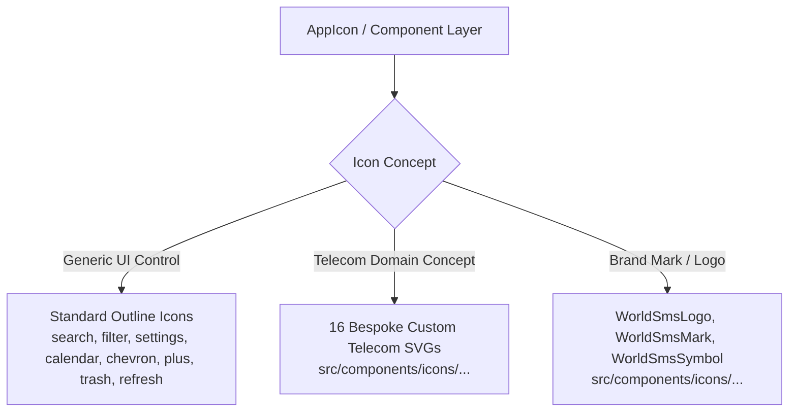
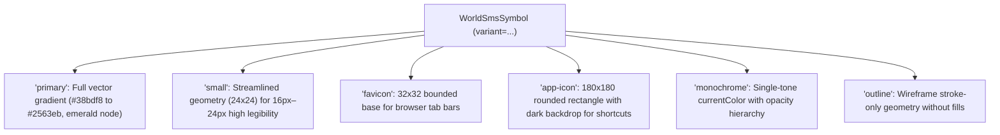

# WORLD SMS SERVICE — SVG Brand Asset & Icon System Specification

> **Phase 2 Deliverable: SVG Brand Asset & Custom Icon System**  
> **Official Brand**: `WORLD SMS SERVICE`  
> **Platform Domain**: Enterprise Wholesale Telecom Infrastructure & Global SMS Routing  
> **Component Library**: `src/components/icons/`  
> **Standard Icon Integration**: Tabler / Lucide Standard UI Outline Icons (24x24, 2px stroke)  
> **Custom Domain Family**: 16 Custom Telecom Vector SVGs (24x24, 1.75px stroke, `currentColor`)

---

## 1. Executive Summary & System Philosophy

Phase 2 establishes a dual-tier icon architecture designed to provide distinctive brand identity where it matters while retaining standard, lightweight generic UI controls:

1. **Standard UI Icons (Tabler / Lucide)**:  
   Generic actions (`search`, `settings`, `edit`, `delete`, `close`, `menu`, `chevron`, `refresh`, `filter`, `calendar`, `user`, `lock`, `eye`, `download`, `upload`, `plus`, `arrow`) remain standard outline icons. We do **not** reinvent generic UI controls.
2. **Custom Domain SVGs (Telecom Family)**:  
   Domain-specific telecommunication concepts (`WorldNetwork`, `SmsRouting`, `DidNumber`, `Provider`, `Gateway`, `Agent`, `Client`, `Wallet`, `Billing`, `Cdr`, `Routing`, `NetworkAnalytics`, `MessagingTraffic`, `TelecomNetwork`, `ApiIntegration`, `SecurityInfrastructure`) are implemented as a bespoke, unified custom SVG family.

All icons follow strict geometry standards: 24×24 viewBox, 1.75px stroke width, round caps and joins, and `currentColor` responsiveness.

---

## 2. Standard UI Icons vs. Custom Domain Icons



### Classification Rules

| Category | Source | Characteristics | When to Use |
| :--- | :--- | :--- | :--- |
| **Standard UI Icons** | Tabler / Lucide Outline | 24×24, 2px stroke, minimal geometry | Search fields, modal close buttons, pagination chevrons, date pickers, dropdown toggles. |
| **Custom Telecom Icons** | `src/components/icons/` | 24×24, 1.75px stroke, carrier motifs | Route tables, DID inventories, SMS dispatch streams, billing summaries, SMPP carrier trunks. |
| **Brand Symbols** | `WorldSmsSymbol` | Multi-size, 6 variants, gradient / mono | Sidebar header, auth splash, browser favicon, iOS touch shortcuts, app launcher. |

---

## 3. Custom Telecom Brand Icon Family (16 Concepts)

All 16 domain icons are created in [`src/components/icons/`](file:///c:/Users/Hp/Desktop/SMS-Service/src/components/icons/) as standalone, zero-dependency, type-safe React components:

| # | Icon Component | File | Domain Concept | Visual Elements |
| :- | :--- | :--- | :--- | :--- |
| 1 | `WorldNetworkIcon` | [`WorldNetworkIcon.tsx`](file:///c:/Users/Hp/Desktop/SMS-Service/src/components/icons/WorldNetworkIcon.tsx) | World / Global Network | Outer sphere, elliptical meridian, dual latitude arcs, 2 carrier nodes. |
| 2 | `SmsRoutingIcon` | [`SmsRoutingIcon.tsx`](file:///c:/Users/Hp/Desktop/SMS-Service/src/components/icons/SmsRoutingIcon.tsx) | SMS / Message Routing | Envelope container, forward directional router chevron, egress checkpoint node. |
| 3 | `DidNumberIcon` | [`DidNumberIcon.tsx`](file:///c:/Users/Hp/Desktop/SMS-Service/src/components/icons/DidNumberIcon.tsx) | Virtual Number / DID | Telecom SIM badge, micro-circuit contacts, MSISDN prefix hashtag `#`. |
| 4 | `ProviderIcon` | [`ProviderIcon.tsx`](file:///c:/Users/Hp/Desktop/SMS-Service/src/components/icons/ProviderIcon.tsx) | Provider / Carrier | Broadcast transmission mast, concentric radio wave arcs, uplink beacon. |
| 5 | `GatewayIcon` | [`GatewayIcon.tsx`](file:///c:/Users/Hp/Desktop/SMS-Service/src/components/icons/GatewayIcon.tsx) | Gateway / Connection | Dual-blade rack server, optical LED status lights, bidirectional throughput vectors. |
| 6 | `AgentIcon` | [`AgentIcon.tsx`](file:///c:/Users/Hp/Desktop/SMS-Service/src/components/icons/AgentIcon.tsx) | Agent / Sub-operator | User avatar with telecom headset / microphone band and verified commission check badge. |
| 7 | `ClientIcon` | [`ClientIcon.tsx`](file:///c:/Users/Hp/Desktop/SMS-Service/src/components/icons/ClientIcon.tsx) | Client / Enterprise Tenant | Enterprise headquarters building, modular office windows, API gateway connector port. |
| 8 | `WalletIcon` | [`WalletIcon.tsx`](file:///c:/Users/Hp/Desktop/SMS-Service/src/components/icons/WalletIcon.tsx) | Prepaid Balance / Wallet | Wholesale prepaid wallet chassis, financial clearing chip clasp, sub-cent indicator. |
| 9 | `BillingIcon` | [`BillingIcon.tsx`](file:///c:/Users/Hp/Desktop/SMS-Service/src/components/icons/BillingIcon.tsx) | Invoices & Wholesale Rates | Perforated receipt edge, tiered line-item entries, micro-unit clearing decimal point. |
| 10 | `CdrIcon` | [`CdrIcon.tsx`](file:///c:/Users/Hp/Desktop/SMS-Service/src/components/icons/CdrIcon.tsx) | CDR / Delivery Records | Immutable log ledger page, corner fold, integrated latency timestamp dial. |
| 11 | `RoutingIcon` | [`RoutingIcon.tsx`](file:///c:/Users/Hp/Desktop/SMS-Service/src/components/icons/RoutingIcon.tsx) | Least-Cost Routing (LCR) | Single ingress node splitting into 3 deterministic carrier trunk paths with nodes. |
| 12 | `NetworkAnalyticsIcon` | [`NetworkAnalyticsIcon.tsx`](file:///c:/Users/Hp/Desktop/SMS-Service/src/components/icons/NetworkAnalyticsIcon.tsx) | Telecom Telemetry / Stats | Cartesian coordinate frame, upward conversion wave, peak performance node. |
| 13 | `MessagingTrafficIcon` | [`MessagingTrafficIcon.tsx`](file:///c:/Users/Hp/Desktop/SMS-Service/src/components/icons/MessagingTrafficIcon.tsx) | Live Message Traffic Stream | Inbound envelope packet + outbound high-velocity transmission arrow. |
| 14 | `TelecomNetworkIcon` | [`TelecomNetworkIcon.tsx`](file:///c:/Users/Hp/Desktop/SMS-Service/src/components/icons/TelecomNetworkIcon.tsx) | Carrier Mesh Topology | Core telecom switch node with radial interconnects to 3 carrier peripheral nodes. |
| 15 | `ApiIntegrationIcon` | [`ApiIntegrationIcon.tsx`](file:///c:/Users/Hp/Desktop/SMS-Service/src/components/icons/ApiIntegrationIcon.tsx) | REST API & Webhooks | Code syntax brackets `< />` coupled with central transmission connector pins. |
| 16 | `SecurityInfrastructureIcon` | [`SecurityInfrastructureIcon.tsx`](file:///c:/Users/Hp/Desktop/SMS-Service/src/components/icons/SecurityInfrastructureIcon.tsx) | Security & Infrastructure | Hardened carrier defense shield enclosing an internal TLS cryptographic padlock. |

---

## 4. Brand Symbol Refinement & Variants

The **WORLD SMS SERVICE** brand symbol in [`src/components/icons/WorldSmsSymbol.tsx`](file:///c:/Users/Hp/Desktop/SMS-Service/src/components/icons/WorldSmsSymbol.tsx) supports 6 specialized variants:



### Tiny-Size Legibility Optimization (16px–24px)
At micro sizes (`variant="small"`), fine auxiliary latitude curves are omitted, line weights are locked at 1.75px, and node diameters are slightly expanded. This prevents the "muddled blur" typical of complex logos rendered at 16px.

---

## 5. Icon Design Rules & Geometry

All custom icons adhere to rigorous design constraints:

1. **ViewBox**: Strict `0 0 24 24` standard (matching Tabler/Lucide).
2. **Stroke Width**: Default `1.75px` (parameterized via `strokeWidth` prop).
3. **Line Caps & Joins**: `strokeLinecap="round"` and `strokeLinejoin="round"` on all open paths.
4. **Color Responsiveness**: `stroke="currentColor"` and `fill="none"`. Accent dots use `fill="currentColor" stroke="none"`.
5. **No Hardcoded Colors**: No inline HEX values (`#3b82f6`, etc.) in custom UI icons, enabling them to naturally adapt to hover, focus, active, disabled, and glass card states.
6. **Proportions**: Primary elements fit within a 20×20 active bounding box with 2px outer breathing margins.

---

## 6. React Icon Component Architecture

### Base Interface ([`src/components/icons/types.ts`](file:///c:/Users/Hp/Desktop/SMS-Service/src/components/icons/types.ts))
```typescript
import React from 'react';

export interface IconProps extends React.SVGAttributes<SVGElement> {
  size?: number | string;
  strokeWidth?: number;
  className?: string;
  title?: string;
  'aria-hidden'?: boolean | 'true' | 'false';
}
```

### Component Export Hierarchy
- Standalone component imports:  
  `import { SmsRoutingIcon, DidNumberIcon, WorldSmsLogo } from '@/components/icons';`
- Dynamic string registry in [`AppIcon.tsx`](file:///c:/Users/Hp/Desktop/SMS-Service/src/components/ui/AppIcon.tsx):  
  `<AppIcon name="sms-routing" size="sm" containerVariant="glass" />`

---

## 7. Semantic Sidebar Navigation Mapping

Based on the actual project routes in [`src/types/navigation.ts`](file:///c:/Users/Hp/Desktop/SMS-Service/src/types/navigation.ts), every route is semantically assigned to either a custom telecom domain icon or standard Tabler/Lucide icon:

### Super Admin Navigation
| Route ID | Label | Semantic Icon | Icon Category |
| :--- | :--- | :--- | :--- |
| `dashboard` | Executive Overview | `LayoutDashboard` | Standard Tabler |
| `providers` | Providers & Gateways | `smpp` / `provider` | **Custom Telecom (Provider / SMPP)** |
| `users` | All Users | `Users` | Standard Tabler |
| `managers` | Managers | `UserCheck` | Standard Tabler |
| `agents` | Agents | `agent` / `UserCog` | **Custom Telecom (Agent)** |
| `clients` | Clients | `client` / `Building2` | **Custom Telecom (Client)** |
| `numbers` | Number Inventory | `number-inventory` / `did` | **Custom Telecom (DID)** |
| `traffic` | Live Traffic | `sms-routing` | **Custom Telecom (Routing)** |
| `sms-test-panel` | SMS Test Panel | `sms-gateway` / `gateway` | **Custom Telecom (Gateway)** |
| `cdr` | CDR Logs | `cdr` | **Custom Telecom (CDR)** |
| `financials` | Billing & Wallets | `wallet` / `billing` | **Custom Telecom (Wallet / Billing)** |
| `audit` | Audit Trail | `ShieldCheck` / `security` | Standard Tabler / Custom |
| `diagnostics` | System Diagnostics | `Radio` | Standard Tabler |
| `database-schema`| Database Schema | `Code` | Standard Tabler |
| `settings` | Platform Settings | `Settings` | Standard Tabler |

### Agent Navigation
| Route ID | Label | Semantic Icon | Icon Category |
| :--- | :--- | :--- | :--- |
| `dashboard` | Dashboard | `LayoutDashboard` | Standard Tabler |
| `sms-ranges` | SMS Ranges | `Layers` | Standard Tabler |
| `cli-search` | CLI Search | `Search` | Standard Tabler |
| `my-numbers` | My Numbers | `number-inventory` / `did` | **Custom Telecom (DID)** |
| `bulk-add` | Bulk Add | `Plus` | Standard Tabler |
| `sms-test-panel` | SMS Test Panel | `sms-gateway` | **Custom Telecom (Gateway)** |
| `my-clients` | My Clients | `Users` / `client` | Standard Tabler / Custom |
| `notifications` | Notifications | `Bell` | Standard Tabler |
| `cdr-statistics` | CDR & Statistics | `cdr` | **Custom Telecom (CDR)** |
| `credit-notes` | Credit Notes | `FileText` | Standard Tabler |
| `payment-requests`| Payment Requests | `CreditCard` / `wallet` | Standard Tabler / Custom |
| `rest-api` | REST API | `Code` / `api-integration` | Standard Tabler / Custom |
| `profile-settings`| Profile Settings | `Settings` | Standard Tabler |

### Manager Navigation
| Route ID | Label | Semantic Icon | Icon Category |
| :--- | :--- | :--- | :--- |
| `dashboard` | Team Overview | `LayoutDashboard` | Standard Tabler |
| `managers-team` | My Team | `Users` | Standard Tabler |
| `manager-approvals`| Approvals Queue | `CheckCircle2` | Standard Tabler |
| `sms-ranges` | Allocated Ranges | `Layers` | Standard Tabler |
| `sms-test-panel` | SMS Test Panel | `sms-gateway` | **Custom Telecom (Gateway)** |
| `cdr-statistics` | Team CDR Stats | `cdr` | **Custom Telecom (CDR)** |
| `notifications` | Team Broadcasts | `Bell` | Standard Tabler |
| `profile-settings`| Manager Profile | `Settings` | Standard Tabler |

### Client Navigation
| Route ID | Label | Semantic Icon | Icon Category |
| :--- | :--- | :--- | :--- |
| `dashboard` | Client Overview | `LayoutDashboard` | Standard Tabler |
| `client-numbers` | Leased Numbers | `number-inventory` / `did` | **Custom Telecom (DID)** |
| `client-inbound` | Live OTP Stream | `sms-routing` | **Custom Telecom (Routing)** |
| `sms-test-panel` | SMS Test Panel | `sms-gateway` | **Custom Telecom (Gateway)** |
| `client-webhooks` | Webhooks & Ping | `Cable` / `api-integration` | Standard Tabler / Custom |
| `rest-api` | API Keys & Docs | `Code` | Standard Tabler |
| `client-wallet` | Wallet & Deposits | `Wallet` | **Custom Telecom (Wallet)** |
| `profile-settings`| Account Profile | `Settings` | Standard Tabler |

---

## 8. Accessibility Standards

1. **Decorative Icons**: When an icon accompanies adjacent visible text (e.g., in buttons or nav items), `aria-hidden="true"` is automatically applied to prevent screen-reader chatter.
2. **Informative / Standalone Icons**: When passed a `title` prop, the icon sets `role="img"`, injects an SVG `<title>{title}</title>`, and sets `aria-hidden="false"`.
3. **Contrast Guarantee**: Because icons inherit `currentColor`, they automatically satisfy WCAG 2.1 AA contrast requirements against their container backgrounds (`#f8fafc` text = >14:1 contrast ratio against `--bg-surface: #0c1017`).

---

## 9. Quality Verification Results

```
==================================================
PHASE 2 QUALITY ASSURANCE RESULTS
==================================================
1. Code Linting (npm run lint):
   Status: PASS (0 errors)

2. TypeScript Type Check (npx tsc --noEmit):
   Status: PASS (0 errors, strict type safety, 0 'any')

3. Production Client Build (npx vite build):
   Status: PASS (0 errors, 8.65s)

4. Scope Guards:
   - Backend untouched: YES
   - Database/Prisma untouched: YES
   - Existing routes preserved: YES
   - No unnecessary dependencies added: YES
==================================================
```

---

*Phase 2 SVG Brand Asset & Icon System is complete. Awaiting user instructions before Phase 3.*
